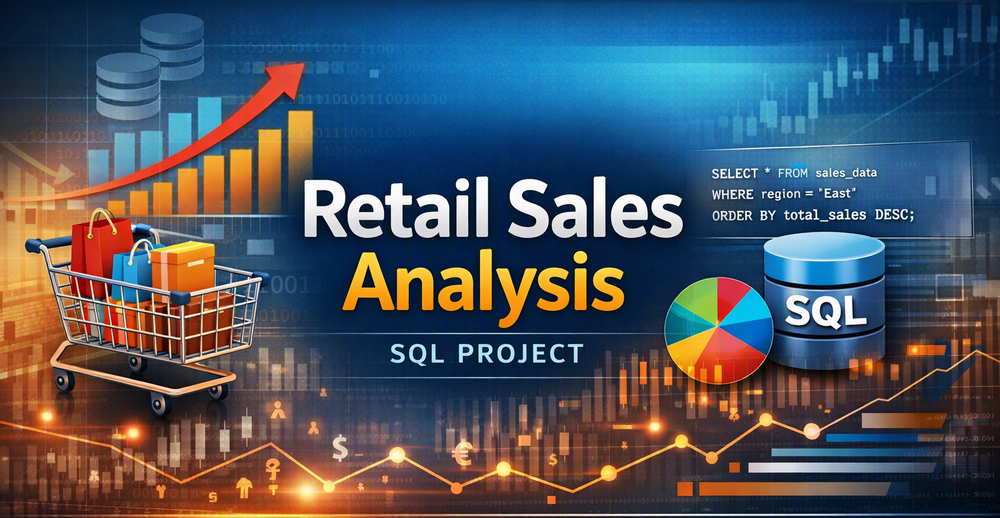

# 🛒 Retail Sales Analysis | PostgreSQL Database Project

> SQL project demonstrating database design, data cleaning, exploratory data analysis, and business analytics using PostgreSQL.

<p align="center">

</p>


---

## Project Overview

| Category | Details |
|----------|---------|
| **Database** | PostgreSQL |
| **Domain** | Retail Sales |
| **Tables** | 1 |
| **Business Use Cases** | 10 |
| **Data Cleaning Steps** | 2 |
| **Dataset** | CSV File |

---

## 📊 Project Metrics

| Metric | Value |
|---------|------:|
| Database Tables | 1 |
| SQL Scripts | 1 |
| Business Use Cases | 10 |
| Window Function Queries | 1 |
| CTE Queries | 1 |
| CSV Datasets | 1 |

---

## Table of Contents

- Executive Summary
- Business Problem
- Project Objectives
- Business Value
- Technology Stack
- Database Architecture
- Business Use Cases
- SQL Skills Demonstrated
- Project Structure
- Key Features
- Execution Workflow
- Future Enhancements
- License

---

## Executive Summary

The Retail Sales Analysis project is an end-to-end SQL project developed using PostgreSQL to analyze retail transaction data.

The project demonstrates database design, data cleaning, exploratory data analysis, and business-focused analytical querying by examining customer demographics, product categories, sales trends, and shift-wise order patterns.

It showcases how SQL can be used to transform raw transactional data into actionable retail business insights.

---

## Business Problem

Retail businesses generate large volumes of transactional data covering customers, products, and sales.

Without structured analysis, this leads to:

- Limited visibility into best- and worst-performing product categories
- Difficulty identifying high-value customers
- No clear understanding of peak sales periods or shopping shifts
- Inconsistent or incomplete transactional data affecting reporting accuracy

This project addresses these challenges by cleaning the raw dataset and building a set of analytical SQL queries to answer key retail business questions.

---

## Project Objectives

- Design and populate a retail sales table
- Clean the dataset by identifying and removing incomplete records
- Explore the dataset (unique customers, categories, transaction volume)
- Answer 10 real-world retail business questions using SQL
- Apply window functions and CTEs to solve ranking-based problems
- Segment transactions by time-of-day shift

---

## 💼 Business Value

This project demonstrates how SQL can support retail business decisions by:

- Identifying top-performing product categories by revenue.
- Highlighting the highest-value customers for targeted engagement.
- Revealing the best-selling month per year to inform seasonal planning.
- Segmenting transactions by shift (Morning/Afternoon/Evening) to optimize staffing.
- Ensuring data quality through systematic null-value cleaning.

---

## Technology Stack

| Category | Technology |
|----------|------------|
| Database | PostgreSQL |
| SQL | PostgreSQL SQL |
| Version Control | Git |
| Repository | GitHub |

---

## Database Architecture

The project uses a single denormalized transactional table designed for analytical querying.

| Table | Description |
|--------|-------------|
| **retail_sales** | Stores individual sales transactions including customer demographics, product category, quantity, pricing, and total sale value. |

| Column | Description |
|---|---|
| `transactions_id` | Unique transaction identifier (Primary Key) |
| `sale_date`, `sale_time` | Date and time of the transaction |
| `customer_id` | Unique customer identifier |
| `gender`, `age` | Customer demographics |
| `category` | Product category purchased |
| `quantity` | Units sold |
| `price_per_unit` | Price per unit |
| `cogs` | Cost of goods sold |
| `total_sale` | Total transaction value |

---

## Business Use Cases

| Scenario | Business Objective |
|----------|--------------------|
| Retrieve Sales by Date | Support day-specific transaction review |
| Filter High-Quantity Category Sales | Track bulk purchase behavior |
| Total Sales by Category | Measure category-wise revenue |
| Average Customer Age by Category | Understand customer demographics |
| High-Value Transaction Report | Identify large purchases |
| Transactions by Gender & Category | Analyze demographic purchase patterns |
| Best-Selling Month per Year | Support seasonal sales planning |
| Top 5 Customers by Spend | Enable targeted customer engagement |
| Unique Customers per Category | Measure category reach |
| Shift-Wise Order Segmentation | Optimize staffing by peak hours |

---

## SQL Skills Demonstrated

- Database & Table Design
- Data Cleaning (NULL handling, DELETE operations)
- Exploratory Data Analysis
- Aggregate Functions
- GROUP BY / ORDER BY
- Window Functions (RANK() OVER PARTITION BY)
- Common Table Expressions (CTEs)
- CASE Statements
- Date/Time Functions (EXTRACT, TO_CHAR)
- Business Reporting

---

## Project Structure

```text
retail-sales-analysis
│
├── data
├── sql
├── documentation
├── assets
├── screenshots
├── LICENSE
└── README.md
```

---

## Key Features

- Clean, Well-Documented SQL Script
- Systematic Data Cleaning Process
- 10 Real-World Business Questions Answered
- Window Function-Based Ranking Analysis
- Shift-Based Time Segmentation
- Reusable, Beginner-to-Intermediate Friendly Query Set

---

## What This Project Demonstrates

This project demonstrates practical experience in:

- Designing and populating a SQL table from raw data
- Cleaning transactional datasets for analysis
- Writing business-focused analytical SQL queries
- Applying window functions and CTEs to solve ranking problems
- Translating raw sales data into actionable business insights

---

## 🔄 Execution Workflow

```text
Create Database
        │
        ▼
Create Table
        │
        ▼
Load Data
        │
        ▼
Clean Data (Handle NULLs)
        │
        ▼
Exploratory Data Analysis
        │
        ▼
Business Analysis Queries
        │
        ▼
Insights & Reporting
```

---

## Future Enhancements

- Build a Power BI dashboard on top of this dataset
- Add database views for recurring reports
- Integrate with Python for automated reporting
- Expand dataset with additional years of data
- Add indexing for query performance optimization

---

## Project Status

**Status:** Completed

This project may evolve further with dashboarding, additional automation, and performance optimization.
