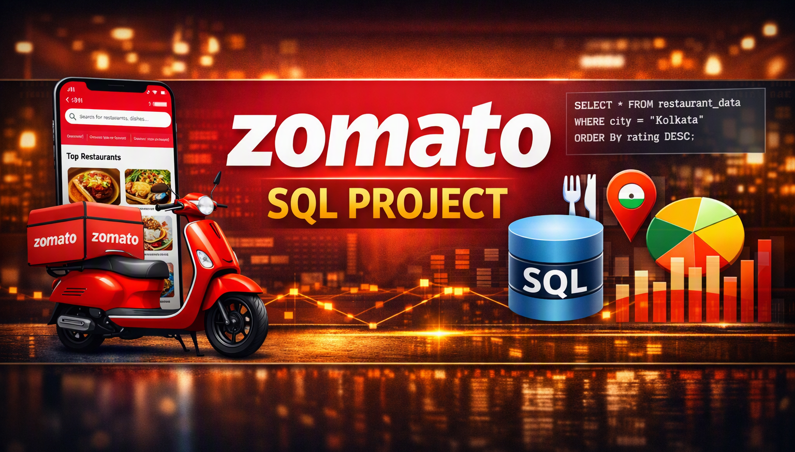
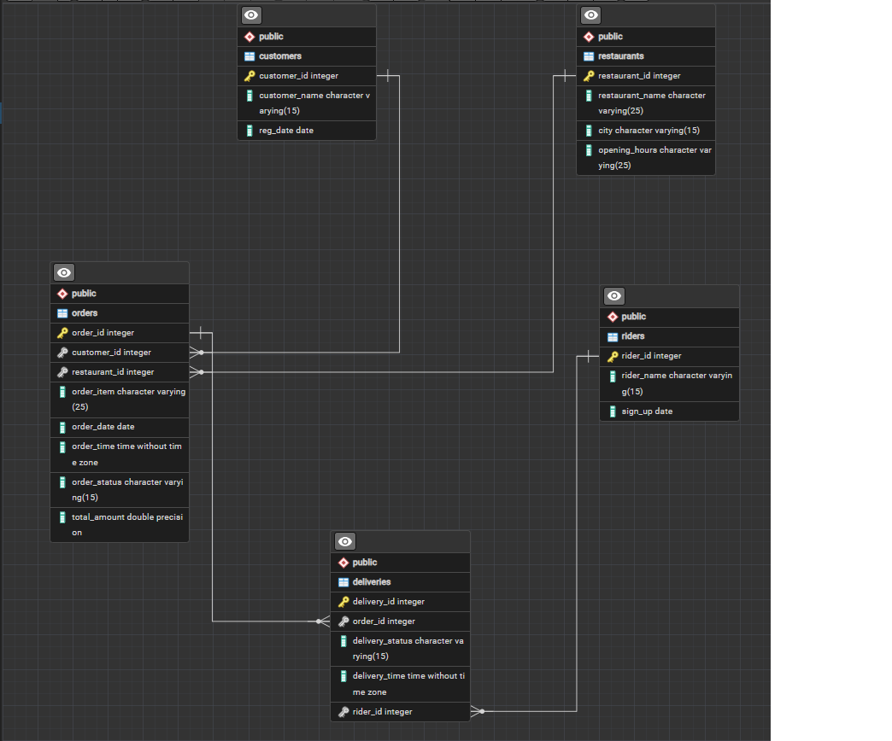

# 🍔 Zomato Data Analysis | PostgreSQL Database Project

> Enterprise-style SQL project demonstrating relational database design, business analytics, and advanced query techniques using PostgreSQL.

<p align="center">

</p>


---

## Project Overview

| Category | Details |
|----------|---------|
| **Database** | PostgreSQL |
| **Domain** | Food Delivery (Zomato) |
| **Tables** | 5 |
| **Business Use Cases** | 20 |
| **Foreign Key Relationships** | 4 |
| **ER Diagram** | Included |
| **Dataset** | CSV Files |

---

## 📊 Project Metrics

| Metric | Value |
|---------|------:|
| Database Tables | 5 |
| SQL Scripts | 5 |
| Business Use Cases | 20 |
| Foreign Key Relationships | 4 |
| Window Function Queries | 8 |
| CTE Queries | 8 |
| CSV Datasets | 5 |

---

## Table of Contents

- Executive Summary
- Business Problem
- Project Objectives
- Business Value
- Technology Stack
- Database Architecture
- Entity Relationship Diagram
- Business Use Cases
- SQL Skills Demonstrated
- Project Structure
- Key Features
- Execution Workflow
- Future Enhancements
- License

---

## Executive Summary

The Zomato Data Analysis project is an end-to-end relational database project developed using PostgreSQL to simulate the operations of a food delivery platform.

The project demonstrates relational database design, data integrity through foreign key constraints, and advanced business analytics by examining customer ordering behavior, restaurant performance, rider efficiency, and revenue trends across five interconnected tables.

It showcases how SQL can be used to solve real-world business problems in the food delivery domain through complex joins, window functions, CTEs, and time-based analysis.

---

## Business Problem

Food delivery platforms generate massive volumes of transactional data involving customers, restaurants, orders, riders, and deliveries.

Without structured analysis, this leads to:

- Limited visibility into customer ordering patterns and high-value customers
- Difficulty identifying underperforming or high-cancellation restaurants
- No clear understanding of rider delivery efficiency and earnings
- Missed opportunities to detect seasonal demand trends
- Inconsistent tracking of order-to-delivery fulfillment

This project addresses these challenges by designing a normalized relational schema and building a comprehensive set of analytical SQL queries to answer key business questions across the platform.

---

## Project Objectives

- Design a normalized relational database across five core entities
- Implement relationships using Primary and Foreign Keys
- Analyze customer ordering behavior and spending patterns
- Evaluate restaurant performance, revenue, and cancellation rates
- Assess rider delivery efficiency, earnings, and ratings
- Identify sales trends, growth rates, and seasonal demand patterns
- Rank restaurants and cities by revenue performance

---

## 💼 Business Value

This project demonstrates how SQL can be used to support food delivery business operations by:

- Identifying top customers and high-value spending segments (Gold/Silver).
- Measuring restaurant performance through revenue ranking and cancellation rates.
- Evaluating rider efficiency and calculating monthly earnings.
- Detecting peak ordering time slots to optimize staffing and operations.
- Uncovering seasonal demand spikes for popular dishes.
- Tracking month-over-month sales trends and restaurant growth.
- Ranking cities by total revenue to guide expansion decisions.

---

## Technology Stack

| Category | Technology |
|----------|------------|
| Database | PostgreSQL |
| SQL | PostgreSQL SQL |
| Database Design | pgAdmin |
| ER Diagram | pgAdmin ERD |
| Version Control | Git |
| Repository | GitHub |

---

## Database Architecture

The Zomato Data Analysis project follows a normalized relational database design consisting of five core entities.

| Table | Description |
|--------|-------------|
| **customers** | Stores customer registration details. |
| **restaurants** | Stores restaurant information, city, and operating hours. |
| **orders** | Records order transactions, linking customers and restaurants. |
| **riders** | Stores rider registration details. |
| **deliveries** | Records delivery transactions, linking orders and riders. |

The database is designed using Primary Keys, Foreign Keys, and referential integrity constraints to maintain data consistency across customers, restaurants, orders, riders, and deliveries.

---

## Entity Relationship Diagram

<p align="center">

</p>

The ER Diagram illustrates the relationships between customers, restaurants, orders, riders, and deliveries.

---

## Business Use Cases

| Scenario | Business Objective |
|----------|--------------------|
| Top 5 Dishes for a Customer | Understand individual customer preferences |
| Peak Order Time Slots | Optimize staffing and kitchen operations |
| Average Order Value (Frequent Customers) | Identify high-engagement customer behavior |
| High-Spending Customers | Support targeted loyalty programs |
| Not-Delivered Orders by Restaurant | Improve fulfillment reliability |
| Restaurant Revenue Ranking by City | Benchmark restaurant performance |
| Most Popular Dish per City | Guide menu and marketing strategy |
| Customers Lost Year-over-Year | Detect churn for re-engagement campaigns |
| Restaurant Cancellation Rate Trends | Monitor service quality over time |
| Rider Average Delivery Time | Evaluate delivery operations |
| Restaurant Month-wise Growth Rate | Track restaurant performance trends |
| Customer Segmentation (Gold/Silver) | Support tiered loyalty strategy |
| Rider Monthly Earnings | Support rider payout calculations |
| Rider Star Ratings | Evaluate rider service quality |
| Peak Order Day per Restaurant | Optimize weekly staffing plans |
| Total Revenue per Customer | Identify lifetime value of customers |
| Month-over-Month Sales Trend | Support financial forecasting |
| Rider Efficiency (Min/Max Delivery Time) | Identify top and underperforming riders |
| Seasonal Demand by Dish | Guide seasonal promotions and inventory |
| City Revenue Ranking | Support expansion and investment decisions |

---

## SQL Skills Demonstrated

- Database Design & Relational Modeling
- Primary & Foreign Keys, Referential Integrity
- INNER JOIN, LEFT JOIN
- GROUP BY, HAVING
- Aggregate Functions
- Common Table Expressions (CTEs)
- Window Functions (RANK, DENSE_RANK, LAG)
- CASE Statements
- Date/Time Functions (EXTRACT, TO_CHAR, DATE_TRUNC)
- Subqueries
- Business Reporting & Trend Analysis
- Data Segmentation

---

## Project Structure

```text
zomato-analysis
│
├── data
├── sql
├── documentation
├── assets
├── screenshots
├── LICENSE
└── README.md
```

---

## Key Features

- Normalized Relational Database Design Across 5 Entities
- Referential Integrity via Foreign Keys
- 20 Business-Oriented SQL Queries
- Advanced Window Function & CTE-Based Analysis
- Customer Segmentation (Gold/Silver)
- Rider Performance & Earnings Analysis
- Seasonal Demand & Sales Trend Detection
- Restaurant & City-Level Revenue Ranking

---

## What This Project Demonstrates

This project demonstrates practical experience in:

- Designing normalized, multi-table relational databases
- Writing production-style SQL scripts with clear execution order
- Solving real-world food delivery business problems using SQL
- Applying advanced window functions and CTEs for trend and ranking analysis
- Translating raw transactional data into actionable business insights

---

## 🔄 Execution Workflow

```text
Create Database
        │
        ▼
Create Tables
        │
        ▼
Apply Constraints & Relationships
        │
        ▼
Load Data
        │
        ▼
Business Analysis (Use Cases 1-10)
        │
        ▼
Business Intelligence (Use Cases 11-20)
        │
        ▼
Insights & Reporting
```

---

## Future Enhancements

- Build an interactive Power BI dashboard on top of this dataset
- Add database views for recurring reports
- Implement indexing for query performance optimization
- Develop reusable SQL functions and stored procedures
- Integrate with Python for automated reporting

---

## Project Status

**Status:** Completed

This project may continue to evolve with dashboarding, additional automation, and performance optimization.
